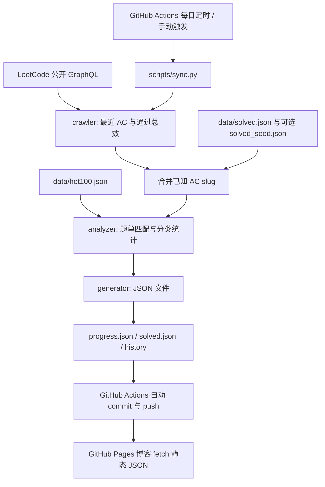

# leetcode-metrics-api

GitHub Actions 驱动的个人 LeetCode 数据流水线：每天同步公开 AC 提交，分析 Hot100 完成情况，将 JSON 和成长记录保存在 Git 仓库中，供 GitHub Pages 博客静态读取。

Python 3.12 + requests + JSON。脚本执行完即退出，无后端服务、数据库、Docker 或服务器部署。

## 数据范围：公开增量记录

项目支持 **leetcode.com 国际站**和 **leetcode.cn 中国站（力扣）** 的公开 GraphQL API，无需浏览器、登录 Cookie 或 LeetCode 密码。通过 `LEETCODE_SITE=com`（默认）或 `LEETCODE_SITE=cn` 选择站点。

`LEETCODE_USERNAME` 填所选站点个人主页 URL 中的账号标识，而不是显示昵称。例如中国站主页为 `https://leetcode.cn/u/example-user/`，应填 `example-user`。两站账号独立，不会自动关联或合并。

国际站公开的 `recentAcSubmissionList` 只返回最近 AC 提交窗口，本项目请求最多 20 条；这不是全部历史 AC 题目，也没有在此接口上可用的完整历史分页。`matchedUser.submitStatsGlobal.acSubmissionNum` 可以提供总通过题数，但不能提供对应的完整题目列表。

中国站使用两个入口：`https://leetcode.cn/graphql/` 查询 `userProfilePublicProfile` 和 `userProfileUserQuestionProgress`，将 Easy/Medium/Hard 的通过数相加；`https://leetcode.cn/graphql/noj-go/` 查询 `recentACSubmissions`。中国站最近记录数量由接口决定，也不保证完整历史。两个入口任意一个失败，整次同步失败，不会输出部分请求结果。

因此，本项目采用 **最近 AC 增量累积 + 可选历史 slug 导入**：

- 每次把最近 AC 题目的 slug 合并到 `data/solved.json`，重复提交只算一题；已记录题目不会因离开最近窗口而丢失。
- 首次同步可能缺少以前完成的题目。如果两次同步之间超过窗口容量，或长期停跑，也可能漏记；每天运行不能保证全量覆盖。
- `coverage.is_complete` 为 `false` 时，`hot100.solved` 是已知完成数的下限，`remaining` 表示**尚未确认完成**，不能直接理解成一定没做过。
- `is_complete` 仅在已知唯一 slug 数与 LeetCode 总通过数相等时为 `true`。这是计数校验，依赖上游统计和手工导入正确，不是完整清单接口的证明。
- 接口发生 HTTP 错误、超时、GraphQL 错误或响应格式变化时，同步失败，不把失败转换为零进度。

## 架构与数据流



职责保持简单：客户端负责请求和响应校验；分析器是无网络、无文件写入的统计函数；写入器负责 JSON 格式化和逐文件原子替换；同步入口负责调度、增量状态和账号一致性检查。

## 目录与关键文件

```text
leetcode-metrics-api/
├── src/
│   ├── crawler/leetcode_client.py  # 公开 GraphQL、超时、重试与响应校验
│   ├── analyzer/hot100.py         # 题单加载、slug 匹配、分类统计
│   ├── generator/json_writer.py  # UTF-8 JSON 与逐文件原子替换
│   └── config.py                 # 环境变量、仓库绝对路径
├── data/
│   ├── hot100.json               # 官方题单元数据，100 道题
│   ├── progress.json             # 最新进度；初始文件尚未同步
│   ├── solved.json               # 首次同步后生成，长期保存的已知 AC slug
│   ├── solved_seed.json          # 可选，由你创建的历史 AC 导入文件
│   └── history/
│       ├── .gitkeep
│       ├── index.json            # 已有快照日期数组，方便博客发现历史
│       └── YYYY-MM-DD.json        # 同步后生成的 UTC 日期快照
├── scripts/sync.py               # 命令行入口
├── tests/                        # unittest 离线单元与集成测试
├── .github/workflows/
│   ├── sync.yml                  # 每日同步与自动提交
│   └── ci.yml                    # push / pull_request 测试
├── .env.example                  # 本地环境变量示例
├── .python-version               # Python 3.12
├── requirements.txt              # 唯一直接运行依赖 requests
├── .gitignore                    # 排除 .env、虚拟环境和缓存
└── README.md
```

模块目录还包含 `__init__.py`。没有前端构建器或 Python 打包步骤，产物就是 `data/` 下的 JSON；不需要 `package.json`、`setup.py` 或容器配置。开发测试使用 Python 自带 `unittest`，无需额外测试依赖。

## 本地运行

安装 Python 3.12 后：

```bash
git clone https://github.com/Piao-2024/leetcode-metrics-api.git
cd leetcode-metrics-api
python3.12 -m venv .venv
source .venv/bin/activate
python -m pip install -r requirements.txt
cp .env.example .env
```

编辑 `.env`，填入站点和该站的账号标识。例如接入中国站：

```dotenv
LEETCODE_SITE=cn
LEETCODE_USERNAME=your_cn_user_slug
```

然后在 Bash / Zsh 中加载变量并运行：

```bash
set -a
source .env
set +a
python scripts/sync.py
```

脚本不自动解析 `.env`，避免为了环境变量引入额外依赖；`.env` 由你的 shell 加载。也可以直接设置变量：

```bash
LEETCODE_SITE=cn LEETCODE_USERNAME=your_cn_user_slug python scripts/sync.py
```

Windows PowerShell 可使用 `.venv\Scripts\Activate.ps1`，然后设置 `$env:LEETCODE_SITE = "cn"` 和 `$env:LEETCODE_USERNAME = "your_cn_user_slug"`，再执行同步命令。国际站将站点设置为 `com` 即可。

成功后会更新 `progress.json`、`solved.json`、当天历史快照和历史索引。失败时返回非零退出码，日志说明原因。文件路径基于仓库位置计算，从其他工作目录调用脚本也可以运行。

验证与生成：

```bash
# 离线测试，不请求真实 LeetCode，也不修改仓库数据
python -m unittest discover -s tests -v

# 检查生成的 JSON
python -m json.tool data/progress.json

# 生成 / 更新静态产物，无需额外 build 命令
python scripts/sync.py
```

测试覆盖请求失败、响应异常、重复 AC、分类统计、百分比、题单合法性、增量累积、同日覆盖、历史记录、账号隔离和失败后数据保留。修改工作流时可另外运行 `actionlint`；它不是项目运行依赖。

## GitHub Actions 配置

1. 将项目文件推送到仓库默认分支。
2. 打开 **Settings → Secrets and variables → Actions → New repository secret**，添加 `LEETCODE_USERNAME`，值为所选站点的个人主页账号标识。
3. 接入中国站时，在同一页面的 **Variables → New repository variable** 添加 `LEETCODE_SITE`，值为 `cn`。不设置时默认 `com`；这里使用 repository variable，不是 Secret。
4. 确保仓库启用了 Actions，并允许工作流写入仓库内容。同步 job 已声明 `contents: write`，无需个人访问令牌。组织策略或分支保护仍可能阻止直接推送。
5. 在 **Actions → Sync LeetCode metrics → Run workflow** 手动运行首次同步，检查日志和 `data/progress.json`。

定时表达式为 `17 2 * * *`：每天 **02:17 UTC / 北京时间 10:17**。GitHub 的定时执行可能延迟；工作流需要存在于默认分支。长期无活动的公共仓库也可能被 GitHub 停用定时工作流，需在 Actions 中重新启用。

流程为 checkout 默认分支 → Python 3.12 → 安装依赖 → 离线测试 → 同步 → 检查 `data/` 差异 → commit / push。提交消息固定为：

```text
update leetcode metrics
```

只有数据变化才提交；每次成功同步会更新 `updated_at`，所以即使题目没变化，通常仍会产生一次提交。当天多次执行只保留当天最后一份快照。失败的同步不会执行提交步骤。

同步工作流串行执行，不会相互抢写。若运行期间默认分支收到其他提交，普通 push 可能失败；重新运行即可，不会自动 force-push。分支保护要求 PR 时，需要为这个数据仓库配置允许同步身份写入的规则。

`ci.yml` 对源码、题单或工作流变更运行离线测试；PR 测试没有写权限，也不需要用户名 Secret。

## JSON 格式

所有输出采用 UTF-8、缩进两空格、末尾换行。百分比范围为 0–100，保留最多两位小数。以下为字段示意，分类与题目数组省略：

```json
{
  "schema_version": 1,
  "site": "cn",
  "username": "your_username",
  "updated_at": "2026-09-17T02:17:00Z",
  "hot100": { "total": 100, "solved": 18, "percentage": 18.0 },
  "categories": { "Hashing": { "total": 4, "solved": 2 } },
  "remaining": [],
  "recent": {
    "submissions": [
      {
        "id": "123456789",
        "title": "Two Sum",
        "slug": "two-sum",
        "submitted_at": "2026-09-16T18:00:00Z"
      }
    ],
    "newly_observed_slugs": ["two-sum"]
  },
  "coverage": {
    "source": "public_recent_ac_with_local_history",
    "is_complete": false,
    "known_solved": 25,
    "reported_solved": 120
  }
}
```

| 字段 | 含义 |
| --- | --- |
| `schema_version` | 输出契约版本，当前为 1 |
| `site` | `com` 或 `cn`；新增字段，旧版没有此字段的记录按 `com` 解释 |
| `username` | 所选站点返回的规范账号标识，中国站为 user slug |
| `updated_at` | 本次成功抓取后的 UTC 时间，ISO 8601 |
| `hot100` | 当前题单总数、已知完成数、百分比 |
| `categories` | 每道题按题单中的一个主分类计数，各分类总数之和等于题单总数 |
| `remaining` | 未匹配到已知 AC 的完整题目元数据，包含 title、slug、difficulty、category |
| `recent.submissions` | 本次接口返回的最近 AC 提交，按时间倒序；同一题可有多次提交 |
| `recent.newly_observed_slugs` | 本次抓取相较已有状态和导入文件新发现的题目，不等于“今天新做的题” |
| `coverage.known_solved` | 所有题目中的已知唯一 AC 数，不限于 Hot100 |
| `coverage.reported_solved` | LeetCode 返回的全站总通过题数 |
| `coverage.is_complete` | 已知 AC 数是否与上游总数一致，见前面的数据范围说明 |

仓库初始 `progress.json` 的 `username` 为空、`updated_at` 和 `reported_solved` 为 `null`、`coverage.source` 为 `uninitialized`；博客应显示“尚未同步”，不要把它当成真实零进度。

`data/history/YYYY-MM-DD.json` 保存与 `progress.json` 相同结构的整份快照，按 **UTC 日期** 命名；`data/history/index.json` 是升序日期数组，例如 `["2026-09-17", "2026-09-18"]`。历史曲线代表每天**观测到的进度**，导入旧题会在导入当天反映，不反推以前每天的真实完成情况。

## 导入首次同步之前的 AC 题目

可选创建 `data/solved_seed.json`：

```json
{
  "site": "cn",
  "username": "your_actual_username",
  "solved_slugs": ["two-sum", "3sum", "longest-substring-without-repeating-characters"]
}
```

填写你确认通过的题目 URL slug，可以包含 Hot100 以外的题目。中国站 LCR/LCP 等题目可能有 `xoh6Oh` 这样的混合大小写 slug，应原样保留。`site` 必须与同步配置一致；国际站使用 `com`。再次同步时会自动去重并合并到 `solved.json`。仅导入 Hot100 AC 能补全该题单统计，但不一定让全站 `coverage.is_complete` 变为 `true`。

导入不验证每个 slug 的真实通过状态，请核对来源。删除 seed 中的条目不会从已经累积的 `solved.json` 中删除；纠错时需要同步修正两个文件。不要随意删除 `solved.json`，公开接口无法保证恢复早期记录；若误删，应从 Git 历史恢复。

本仓库每次维护一个“站点 + 账号”组合。切换站点或账号前，应将原来的 `progress.json`、`solved.json`、可选 seed 和 `history/` 日期快照归档到 `data/` 之外；清理后重新同步，历史索引会重建。脚本拒绝合并不同站点或用户名的记录，即使两个站点用户名相同也不能混用。不要只修改配置后沿用旧数据。

首次接入时，仓库自带的空用户名 `progress.json` 可以直接用于任意站点。旧版缺少 `site` 字段的状态、seed 和历史均视为国际站，原国际站用户可以无缝继续同步；中国站用户不能通过直接改 `site` 字段来复用原国际站 AC 数据。当前不提供同一仓库同时同步两站的独立输出目录。

## Hot100 来源与扩展

`data/hot100.json` 来自 LeetCode 官方 [Top 100 Liked 学习计划](https://leetcode.com/studyplan/top-100-liked/)，于 **2026-09-17** 通过 `studyPlanV2Detail(planSlug: "top-100-liked")` 获取：使用 `planSubGroups.name` 作为主分类，使用题目的 `title`、`titleSlug` 和 `difficulty` 作为元数据。当前共 100 道唯一题目。

保留官方返回的分类，即使它与其他版本的“Hot100”分类不同。题单作为固定 JSON 快照纳入 Git，不在每日同步时自动替换，避免官方改题单后历史统计口径悄然变化。更新时可用相同查询复核，再提交 JSON 变更并运行测试：

两个站点共用这份题单快照，通过题目 slug 匹配；切换数据源不会自动替换为中国站的另一版 Hot100，分类与题目标题仍以本地 JSON 为准。

```graphql
query {
  studyPlanV2Detail(planSlug: "top-100-liked") {
    planSubGroups {
      name
      questions { title titleSlug difficulty }
    }
  }
}
```

新增 NeetCode150、Top Interview 150 或自定义题单时，创建相同格式的 JSON，然后复用 `load_problem_list(path)` 与 `analyze(problems, solved_slugs)`。当前同步入口只输出 `hot100`；增加题单需要在入口添加调用，并明确新 JSON 字段或独立输出文件。分析模块不包含硬编码题目列表。

## 接入 GitHub Pages 个人博客

最简单的接法：**博客部署在 GitHub Pages，数据直接读取本公共仓库默认分支的 Raw JSON**。无需给这个数据仓库另外配置 Pages 发布，也不需要在前端存储 GitHub Token。

默认分支为 `main` 时，地址为：

- [最新进度](https://raw.githubusercontent.com/Piao-2024/leetcode-metrics-api/main/data/progress.json)
- [历史日期索引](https://raw.githubusercontent.com/Piao-2024/leetcode-metrics-api/main/data/history/index.json)
- 每日快照：`https://raw.githubusercontent.com/Piao-2024/leetcode-metrics-api/main/data/history/YYYY-MM-DD.json`

推送项目文件并完成同步后，这些地址才会有对应数据；如果默认分支不是 `main`，请修改 URL。Raw 文件支持浏览器跨域读取，但可能存在 CDN 缓存，不保证提交后立即刷新。

在博客页面放入下面的示例。网络请求失败时显示不可用；覆盖不足时显示“已知完成”，避免误报：

```html
<p id="leetcode-progress">正在读取刷题进度…</p>
<script type="module">
  const base = "https://raw.githubusercontent.com/Piao-2024/leetcode-metrics-api/main/data";
  const element = document.querySelector("#leetcode-progress");

  async function loadJson(path) {
    const response = await fetch(`${base}/${path}`, { cache: "no-cache" });
    if (!response.ok) throw new Error(`HTTP ${response.status}`);
    return response.json();
  }

  try {
    const data = await loadJson("progress.json");
    if (!data.updated_at) {
      element.textContent = "LeetCode 数据尚未同步";
    } else {
      const label = data.coverage.is_complete ? "完成" : "已知完成（记录可能不完整）";
      element.textContent = `Hot100 ${label} ${data.hot100.solved}/${data.hot100.total}`
        + ` · ${data.hot100.percentage}% · 更新于 ${new Date(data.updated_at).toLocaleString()}`;
    }
  } catch (error) {
    element.textContent = "暂时无法读取 LeetCode 数据";
    console.error(error);
  }
</script>
```

成长曲线可在同一模块中复用 `loadJson`，按需读取最近 30 个观测日，将 `points` 交给博客现有图表组件：

```javascript
const days = await loadJson("history/index.json");
const snapshots = await Promise.all(
  days.slice(-30).map(day => loadJson(`history/${day}.json`))
);
const points = snapshots.map(snapshot => ({
  date: snapshot.updated_at.slice(0, 10),
  solved: snapshot.hot100.solved,
  complete: snapshot.coverage.is_complete
}));
```

历史读取也应放在 `try/catch` 中处理失败；图表需要区分完整和不完整记录，并允许缺失日期。前端加载题目标题时使用 `textContent`，避免把外部字符串当作 HTML 插入。

如果以后希望 JSON 也托管在 GitHub Pages，可额外配置显式 Pages 发布工作流；仅靠 `GITHUB_TOKEN` 的自动 commit 不会触发基于分支的 Pages 构建。本项目默认使用 Raw 地址，不依赖这条发布链路。

## 维护注意事项

- 上游 GraphQL 不是稳定性有保证的第三方开放 API，可能发生字段变化、限流或 403。客户端对网络失败、429 和部分 5xx 做有限重试，403 或结构错误直接失败；查看 Actions 日志后再排查，保留已有数据。
- 请求连接超时为 10 秒、读取超时为 30 秒，最多重试 3 次并指数退避。同步 job 最长运行 10 分钟。
- 写入前会完成请求、解析、分析和历史检查；JSON 全部序列化并暂存后逐文件替换。每个文件替换是原子的，多个文件不是数据库事务；磁盘异常或进程中断可能只替换部分文件，此时不要提交不一致数据，恢复后重跑。Actions 仅在脚本成功后提交。
- `LEETCODE_USERNAME` 和 `LEETCODE_SITE` 从环境变量读取，没有硬编码凭据。即使用户名存放在 Secret 中，生成的 JSON 也会公开站点、用户名、题目和提交时间，这是博客展示所需的数据。
- 公开博客的无认证请求需要公开可读取的数据；不要把访问私有仓库的 Token 放进博客 JavaScript。
- 目前支持单个站点账号组合、国际站/中国站切换、Hot100 输出和每日观测快照；不包含全量历史认证抓取、排名分析或提交源码下载。没有未实现的 TODO/FIXME 占位代码。
